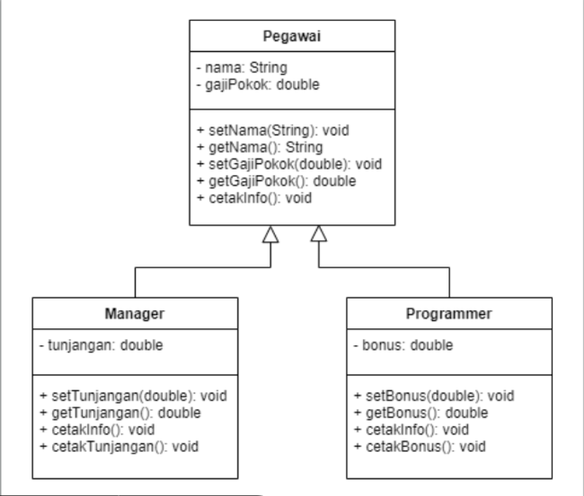

# Praktikum3.java

<p> • Lengkapi latihan class
Mahasiswa dengan
setter dan getter.</p>

```
public class mahasiswa extends Manusia {
    String nim;
    String jurusan;

     public mahasiswa(String nama, String jenisKelamin, int umur, String alamat, String nim, String jurusan) {
        super(nama, jenisKelamin, umur, alamat);
        this.nim = nim;
        this.jurusan = jurusan;
    }

    // Getter dan Setter untuk Mahasiswa
    public String getNim() {
        return nim;
    }

    public void setNim(String nim) {
        this.nim = nim;
    }

    public String getJurusan() {
        return jurusan;
    }

    public void setJurusan(String jurusan) {
        this.jurusan = jurusan;
    }
}
```
<p>* Kelas mahasiswa ini adalah subclass dari kelas manusia yang memperluas kelas manusia dengan menambahkan atribut khusus
yang dimiliki oleh mahasiswa, yaitu NIM dan Jurusan.</p>
<p>* Hubungan kelas manusia dengan kelas mahasiswa adalah subclass yang mewarisi atribut dan metode dari superclass manusia.</p>
<p>artinya objek mahasiswa dapat mengakses atribut dan metode dari manusia seperti nama, jeniskelamin, umur, dan alamat, serta dapat menggunakan metode yang ada di kelas manusia.</p>

## Output


<p>• Implementasikan java kode diagram pada class berikut :</p>


<p>- Menampilkan class Pegawai</p>

```
package pegawai;
public class Pegawai {
     private String nama;
    private double gajiPokok;

    // Setter dan Getter untuk nama
    public void setNama(String nama) {
        this.nama = nama;
    }

    public String getNama() {
        return nama;
    }

    // Setter dan Getter untuk gajiPokok
    public void setGajiPokok(double gajiPokok) {
        this.gajiPokok = gajiPokok;
    }

    public double getGajiPokok() {
        return gajiPokok;
    }

    // Method untuk mencetak informasi
    public void cetakInfo() {
        System.out.println("Nama: " + nama);
        System.out.println("Gaji Pokok: " + gajiPokok);
    }
    
    
}
```
<p>- Menampilkan class Manager</p>

```
public class Manager extends Pegawai {
    private double tunjangan;

    // Setter dan Getter untuk tunjangan
    public void setTunjangan(double tunjangan) {
        this.tunjangan = tunjangan;
    }

    public double getTunjangan() {
        return tunjangan;
    }

    // Override method cetakInfo
    @Override
    public void cetakInfo() {
        super.cetakInfo();
        System.out.println("Tunjangan: " + tunjangan);
    }

    // Method untuk mencetak tunjangan
    public void cetakTunjangan() {
        System.out.println("Tunjangan: " + tunjangan);
    }
    
}
```

<p>- Menampilkan class Progammer</p>

```
public class Progammer extends Pegawai {
     private double bonus;

    // Setter dan Getter untuk bonus
    public void setBonus(double bonus) {
        this.bonus = bonus;
    }

    public double getBonus() {
        return bonus;
    }

    // Override method cetakInfo
    @Override
    public void cetakInfo() {
        super.cetakInfo();
        System.out.println("Bonus: " + bonus);
    }

    // Method untuk mencetak bonus
    public void cetakBonus() {
        System.out.println("Bonus: " + bonus);
    }
    
    
}
```

<p>- Menampilkan class Main</p>

```
public class Main {
    public static void main(String[] args) {
        // Membuat objek Manager
        Manager manajer = new Manager();
        manajer.setNama("Budi");
        manajer.setGajiPokok(5000000);
        manajer.setTunjangan(2000000);
        manajer.cetakInfo();

        // Membuat objek Programmer
        Progammer programmer = new Progammer();
        programmer.setNama("Siti");
        programmer.setGajiPokok(4000000);
        programmer.setBonus(1000000);
        programmer.cetakInfo();
}

    
}
```

<p>* Pada implementasi ini, class Manager dan Progammer mewarisi atribut dan metode dari class Pegawai.</p>
<p>* kemudian juga menambahkan atribut baru yaitu tunjangan untuk Manager dan bonus untuk Progammer, dengan menggunakan metode Setter, Getter, dan metode untuk mencetak i formasi yang relevan.</p>

## Output

![output (2)](
